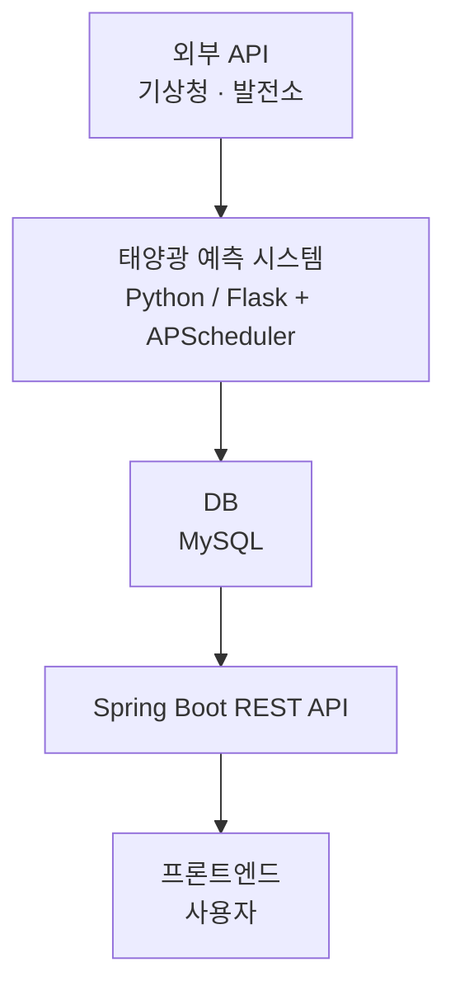

# ☀️ HelioCast — 태양광 발전소 모니터링 및 발전량 예측 시스템

> 전남 영광·무안·장성 3개소, 총 500MW급 태양광 발전량 데이터(2022~2025.04) 기반  
> 시간대별 합산 발전량을 활용한 중단기 예측 및 실시간 모니터링 시스템

기상 데이터와 시계열 분석 모델(ARIMA/SARIMA)을 활용해 태양광 발전량을 예측·모니터링하는 웹 기반 통합 관제 시스템입니다.

## 🎯 프로젝트 목표

태양광 발전은 기상 조건에 따라 변동성이 크고 예측이 어렵습니다. 실시간 모니터링과 중단기 발전량 예측을 통해 발전소 운영 효율화 및 전력 계통 안정성 확보를 목표로 했습니다.

## 🛠 기술 스택

**Backend**

  
  
  
  
  

**Data / ML**

  
  
  

**Database**

  

**Infra / Tool**

  
  

## 🏗 시스템 개념도

## 📊 예측 모델 비교

| 모델 | 특징 | 결과 |
|---|---|---|
| ARIMA | 자기회귀 + 차분 + 이동평균 | 계절성 미반영 → 야간 발전 예측 오류 |
| SARIMA | ARIMA + 계절성 요소 추가 | 야간 발전 중단 정확 예측, 중단기 정확도 우수 |

평가 지표: RMSE, MAE, MAPE 기준 SARIMA 최종 채택

## 👤 배재현 주요 역할 및 성과

- 데이터 전처리 파이프라인 구축 — 결측치 0 대체, 무효 행 스킵, SQL CASE WHEN 야간 발전량 제외, 일별 SUM/AVG 집계
- APScheduler 기반 데이터 수집·전처리·예측·저장 일일 배치 자동화 파이프라인 구축
- ARIMA·SARIMA 모델 성능 비교 실험 참여 및 결과 검증 (RMSE·MAE·MAPE 기준 SARIMA 최종 채택)
- 15개 이상 API 명세서·E-R 다이어그램·시퀀스 다이어그램 작성 → 협업 효율 극대화 (문서화 95% 담당)
- 제56회 대한전기학회 하계학술대회 논문 공저자 (ARIMA·SARIMA 기반 태양광 발전량 중단기 예측, 5인 공저)

## 👥 팀원

| 이름 | 역할 |
|---|---|
| 김인겸 | 예측 시스템 학습 및 팀장|
| 김영우 | 실시간 데이터 수집 |
| 김희성 | 프론트 개발 |
| 공민석 | 백앤드 개발 |
| 배재현 | 데이터 전처리 파이프라인, 배치 자동화, 문서화 |
